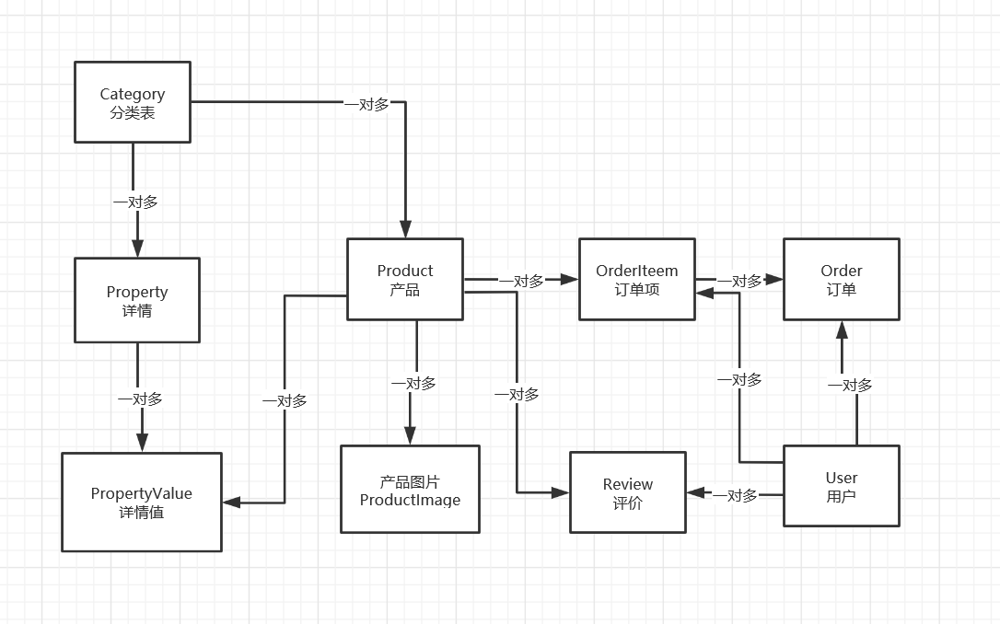
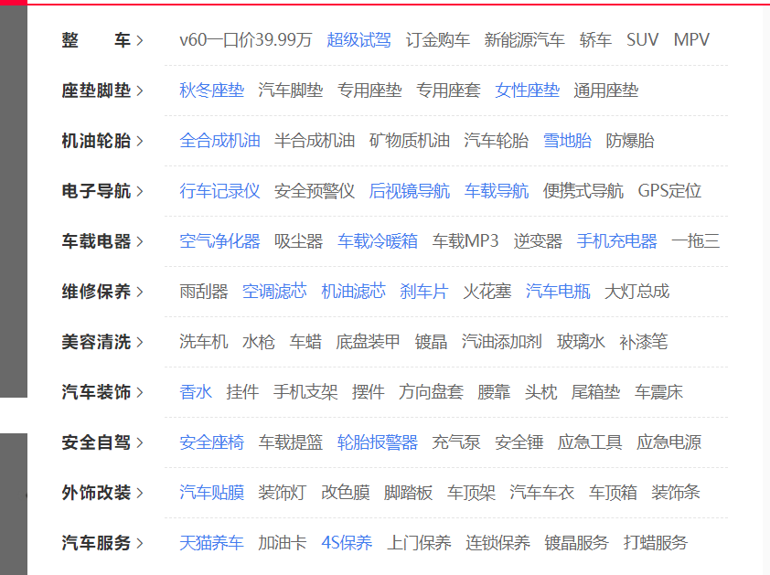
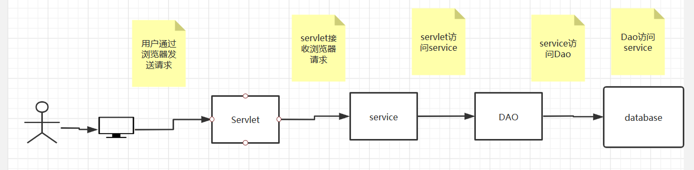
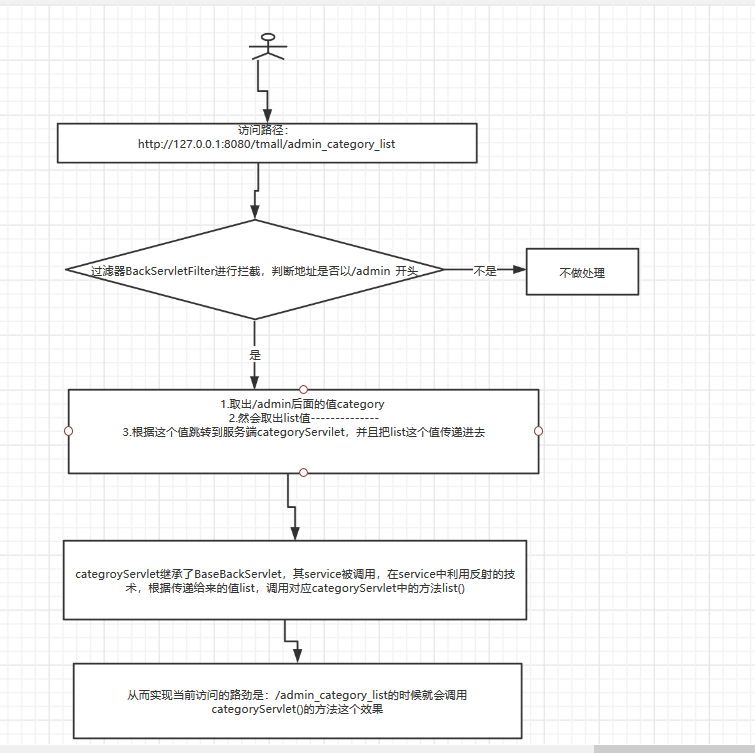
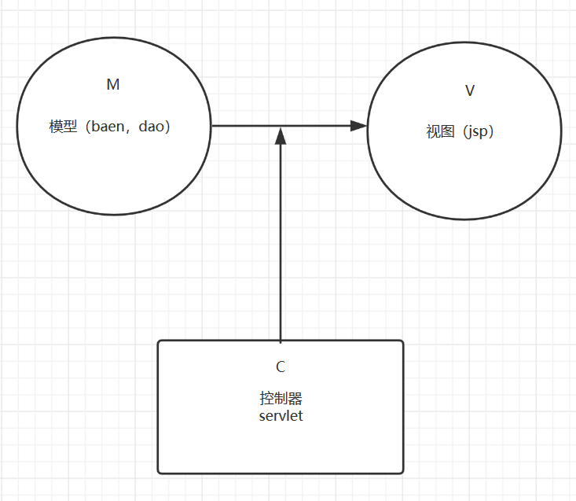

### 概述：


#### 需求分析：

**交互：**通过POST,GET,http协议，与服务器进行同步或者异步交互（ 购买，购物车，生成订单，登录等等功能。 ）

#### **后台分析：**


**产品分类管理：**

​      分页查询

​       新增分类

​       编辑修改

​        删除


**产品详情管理：**

比如手机型号 电池型号  屏幕厂商  摄像头等。

不同的产品有不同的产品详情，以及产品值

按照传统的数据库设计方式，在产品表里设置不同的字段，产品五花八门，有成千上百的详情，就要给产品表成千上百的字段了，这样的字段是不具备维护性的。


为了解决这个问题，就要引入产品详情的概念，假如一类产品都有相同的详情，比如所有的女装，都有，材质成分，尺寸，上市年份季节等等属性。具体到哪一件女装，就要看它们的详情值的不同了

**产品管理：**

分页查询

新增产品

编辑修改

删除

**产品图片管理：**

一个产品，对应多个单个图片（上传）

一个产品，对应多个详情图片（上传）


**产品详情设置：**

比如修改产品详情信息（采用异步的提交方式）

**用户管理：**

用户管理只提供分页查询 用户是不能够删除的，用户的信息也不能被修改只能有前台客户自己修改

用户的增加又前台用户自己注册添加，后台不负责

**订单管理：**

订单分页查询

订单详情

发货

#### 表的设计：

只要正确的把表多结构设计好才能进行后面功能的开发，这一步是非常**重要的**

创建数据库：

 并且将数据库的编码设置为utf8，便于存放中文 

```xml
CREATE DATABASE mimall DEFAULT CHARACTER SET UTF8;
```

表跟表之间的关系：



表：

| 表名          | 含义             | 介绍                                                         |
| ------------- | ---------------- | ------------------------------------------------------------ |
| Category      | 分类表           | 存放分类的信息，手机，电视，空调，风扇等                     |
| Property      | 详情表           | 存放详情信息，如颜色，重量，厂家，型号等                     |
| Product       | 产品表           | 存放产品信息如，小米10，Redmi K30等                          |
| PropertyValue | 详情值           | 存放详情值信息，如重量：100g，颜色：黑色                     |
| ProductImage  | 产品图片         | 存放产品图片信息，产品页显示图片                             |
| Review        | 评价             | 存放用户评价的信息：手机到了很好用，一亿像素照亮我的帅哈哈哈 |
| User          | 用户表           | 存放用户信息：如周杰伦，林俊杰                               |
| Order         | 订单表           | 存放订单信息，如电话号码，邮寄地址，收货人信息               |
| Orderitem     | 订单项表(购物车) | 存放订单项信息，包括购买产品种类，数量等（类似购物车）       |

表与表之间的关系3种

1.一对一 2.一对多3.多对一

一个分类对应多个产品，一个产品对应一个分类

 **注：**产品和用户之间其实是多对多关系，即一个用户可以购买多种产品，一种产品可以被多个用户购买。 但是他们的多对多关系是间接的建立在订单项表(OrderItem 购物车)上的。 

#### 实体类设计：

跟数据库表中相互对应的类 ，**一张表对应一个实体类，一个字段对应一个属性，一个行记录对应一个对象**

  user实体类中因为产评价要使用匿名显示用户，业务是只有一位就显示*,两位后面一位显示    *  其他中间全部显示     *

  

```java 
    //用于产品评价时显示匿名信息
    public String getAnonymousName(String name){

        if(name==null){

            return null;
        }

        //如果用户名以为直接就是*
        if (name.length()==1){
            return "*";
        }

        //如果用户名为两位后面的位*
        if (name.length()<=2){

         return    name.substring(0,1)+"*";//这样就变成了两位第二位就变成了*


        }

        //如果长度大于2，除了前后两个字显示中间全部变成*
               //把名称变为字符数组
        char[] chars = name.toCharArray();

        //除了最前面最后面全部变成*
        for (int i = 1; i <name.length()-1 ; i++) {
              chars[i]='*';
        }
        return new String(chars);
    }
```

Category:分类

```java 
    //分类下的产品
    private List<Product> products;

    //导航栏下通过分类查找产品 分类有下的集合多大 每个集合对应多少产品
    private List<List<Product>>productsByRow
```

如图：    >private List<List<Product>>productsByRow



Property:详情信息

```
   //详情信息跟分类是多对一的关系  比如：手机分类 下的型号、品牌、屏幕、颜色等
    private Category category;
```

Order:订单  

订单状态

```java

            switch(status){
          case OrderDAO.waitPay:
              desc="待付款";
              break;
          case OrderDAO.waitDelivery:
              desc="待发货";
              break;
          case OrderDAO.waitConfirm:
              desc="待收货";
              break;
          case OrderDAO.waitReview:
              desc="等评价";
              break;
          case OrderDAO.finish:
              desc="完成";
              break;
          case OrderDAO.delete:
              desc="刪除";
              break;
          default:
              desc="未知";
            }
```

#### 工具类

#### DBUtil：数据库工具类  便于统一修改降低维护成本

```java
package cn.jinronga.Dao;

import java.sql.Connection;
import java.sql.DriverManager;
import java.sql.SQLException;

/**
 * Created with IntelliJ IDEA.
 * User: 郭金荣
 * Date: 2020/4/5 0005
 * Time: 15:21
 * E-mail:1460595002@qq.com
 * 类说明:数据库驱动连接类
 */
public class DBUtil {

        static String ip = "127.0.0.1";//连接地址
        static int port = 3306; //端口
        static String database = "tmall";//连接的数据
        static String encoding = "UTF-8"; //字节码
        static String loginName = "mimall";//账户
        static String password = "1460595002"; //密码

        static {
            try {
                Class.forName("com.mysql.jdbc.Driver");
            } catch (ClassNotFoundException e) {
                e.printStackTrace();
            }
        }

        public static Connection getConnection() throws SQLException {
            String url = String.format("jdbc:mysql://%s:%d/%s?characterEncoding=%s", ip, port, database, encoding);
            return DriverManager.getConnection(url, loginName, password);
        }

        public static void main(String[] args) throws SQLException {
            System.out.println(getConnection());

        }
    }
```

#### **DateUtil日期工具类：**

 因为在实体类中日期类型的属性，使用的都是java.util.Date类。
而为了在MySQL中的日期格式里保存时间信息，必须使用datetime类型的字段，而jdbc要获取datetime类型字段的信息，需要采用java.sql.Timestamp来获取，否则只会保留日期信息，而丢失时间信息。 

```java
package cn.jinronga.util;

/**
 * Created with IntelliJ IDEA.
 * User: 郭金荣
 * Date: 2020/4/5 0005
 * Time: 15:29
 * E-mail:1460595002@qq.com
 * 类说明:时间类相互转换
 */
public class DateUtil {

    public static java.util.Date  date(java.sql.Timestamp timestamp){

        if (timestamp==null){
            return null;
        }

        return new java.util.Date(timestamp.getTime());
    }

    public  static  java.sql.Timestamp date1(java.util.Date  d){
        if (d==null){
            return null;
        }
        return new java.sql.Timestamp(d.getTime());
    }
}
```

#### 分页工具类：Page

```java
public class Page {

    //开始位置
    int start;
    //每页显示多少
    int count;
    //数据总数
    int total;
//    因为属性分页都是基于当前分类下的分页，所以分页的时候需要传递这个cid
    String param;
    public int getStart() {
        return start;
    }
    public void setStart(int start) {
        this.start = start;
    }
    public int getCount() {
        return count;
    }
    public void setCount(int count) {
        this.count = count;
    }
    public Page(int start, int count) {
        super();
        this.start = start;
        this.count = count;
    }

    public boolean isHasPreviouse(){
        if(start==0)
            return false;
        return true;

    }
    public boolean isHasNext(){
        if(start==getLast())
            return false;
        return true;
    }

    //总共有多少页
    public int getTotalPage(){
        int totalPage;
        // 假设总数是50，是能够被5整除的，那么就有10页
        if (0 == total % count)
            totalPage = total /count;
            // 假设总数是51，不能够被5整除的，那么就有11页
        else
            totalPage = total / count + 1;
        //如果页面没有数据页面就是1
        if(0==totalPage)
            totalPage = 1;
        return totalPage;

    }


    //最后一页
    public int getLast(){
        int last;
        // 假设总数是50，是能够被5整除的，那么最后一页的开始就是45
        if (0 == total % count)
            last = total - count;
            // 假设总数是51，不能够被5整除的，那么最后一页的开始就是50
        else
            last = total - total % count;

        last = last<0?0:last;
        return last;
    }

    public int getTotal() {
        return total;
    }
    public void setTotal(int total) {
        this.total = total;
    }
    public String getParam() {
        return param;
    }
    public void setParam(String param) {
        this.param = param;
    }
}
```


#### DAO层设计(重要)

ORM思想：

Category来举例：

##### 1.add方法：

把一个Category对象插入到数据库中：这里分作两部分：

**首先insert数据到数据库，获取自增主键id，再把数据赋值给Category对象**

##### 2.list查询所有数据：

先把所有数据查出来，转换为category对象，再把category对象放到集合中返回集合

- **需要一个可以把数据库中每一行数据变成category对象的方法**
- **再把category对象放入集合中返回**

CategoryDao：

```java
package cn.jinronga.Dao;

import cn.jinronga.pojo.Category;
import cn.jinronga.util.DBUtil;

import java.sql.*;
import java.util.ArrayList;
import java.util.List;

/**
 * Created with IntelliJ IDEA.
 * User: 郭金荣
 * Date: 2020/4/5 0005
 * Time: 16:06
 * E-mail:1460595002@qq.com
 * 类说明:分类DAO
 */
public class CategoryDao {

    //查询分类总数
    public int getTotal(){
        int total=0;
        /**
         * try()里面的资源出现异常或者程序执行完自动关闭
         */
        try(Connection connection = DBUtil.getConnection(); Statement statement =connection .createStatement();) {


                String sql="select count(*) from category";

                //Statement关闭了就会导致 ResultSet关闭
                ResultSet resultSet = statement.executeQuery(sql);
                while (resultSet.next()){
                    total = resultSet.getInt(1);
                }


            } catch (SQLException e) {
                e.printStackTrace();
            }

            return total;


    }

    //添加

    public  void add(Category category) {

        String sql = "insert into category values(null,?)";

        try (Connection connection = DBUtil.getConnection();
             PreparedStatement preparedStatement = connection.prepareStatement(sql);
        ) {
            //设置预编译sql的值
            preparedStatement.setString(1, category.getName());

             preparedStatement.executeUpdate();
            /**
             * 获取自增长主键，再把数据赋值给对象相应的属性
             */
            //获取数据库的主键
            ResultSet generatedKeys = preparedStatement.getGeneratedKeys();

            if (generatedKeys.next()) {
                int anInt = generatedKeys.getInt(1);
                //设置主键值
                category.setId(anInt);

            }

        } catch (SQLException e) {
            e.printStackTrace();
        }

    }


     //更新
    public void update(Category category){
       String sql="update category set name=? where id=? ";

       try (Connection connection=DBUtil.getConnection();
            PreparedStatement preparedStatement=connection.prepareStatement(sql);
       ){
           preparedStatement.setString(1,category.getName());
           preparedStatement.setInt(2,category.getId());


           preparedStatement.executeUpdate();


       } catch (SQLException e) {
           e.printStackTrace();
       }


    }

    //删除 （通过id删除）
    public void delete(int id){

        String sql="delete from category  where id="+id; //要删除的id
        try (Connection connection=DBUtil.getConnection();
             PreparedStatement preparedStatement=connection.prepareStatement(sql);
        ){
            preparedStatement.executeUpdate();


        } catch (SQLException e) {
            e.printStackTrace();
        }


    }


    //根据id查询
    public Category get(int id){

        Category bean=null;
        String sql="select * from category where id="+id;

        try(Connection connection =DBUtil.getConnection();
          PreparedStatement preparedStatement=connection.prepareStatement(sql);
        ){
            ResultSet resultSet = preparedStatement.executeQuery();

            if (resultSet.next()){
                bean=new Category();
                String name=resultSet.getString(2);
               //将查出来的数据赋值给Category对象
                bean.setId(id);
                bean.setName(name);
            }


        } catch (SQLException e) {
            e.printStackTrace();
        }

   return bean;
    }

   //查询所有
    public List<Category>list(){

        return list(0,Short.MAX_VALUE);
    }

    private List<Category> list(int start, int count) {

        List categorys= new ArrayList();

        String sql="select * from category order by id desc limit ?,?";

        try(Connection connection=DBUtil.getConnection();
          PreparedStatement preparedStatement=connection.prepareStatement(sql);
        ) {

            ResultSet resultSet = preparedStatement.executeQuery();

            while (resultSet.next()){
               Category category=new Category();
                //获取数据库的资源
                int id = resultSet.getInt(1);
                String name = resultSet.getString(2);
                //将数据库的数组赋值给Category对象
                category.setId(id);
                category.setName(name);

                categorys.add(category);//把对象放在集合中

            }

        } catch (SQLException e) {
            e.printStackTrace();
        }
        return categorys;
    }
    }

```

UserDao：（CRUD都差不多不重复，补充不同的地方）

**判断用户名是否存在**

```
//判断用户名存在
     public boolean isExist(String name){

       User user= get(name);

       return user!=null;
     }
     //根据用户名获取对象
    private User get(String name) {
        String sql="select * from user where name=?";
        User user=null;
        try(Connection connection=DBUtil.getConnection();
         PreparedStatement preparedStatement=connection.prepareStatement(sql);
        ){
            preparedStatement.setString(1,name);
            ResultSet resultSet = preparedStatement.executeQuery();

            if(resultSet.next()){
                 user=new User();
                 //数据库中的数据
                int id = resultSet.getInt("id");
                String password = resultSet.getString("password");
                //将数据赋值给user对象
                user.setId(id);
                user.setName(name);
                user.setPassword(password);
            }
        } catch (SQLException e) {
            e.printStackTrace();
        }
        return user;
    }
```

**根据账号密码获取对象， 这才是合理的判断账号密码是否正确的方式，而不是一下把所有的用户信息查出来，在内存中进行比较** 

```java
  //根据账号密码获取对象，用户判断账号密码是否存在，直接跟数据库对比较而不是把全部用户查出来在内存中对比
    public  User getUserAndPassword(String name,String password){

         User user=null;
        String sql ="select * from user where name=? and password=?";
         try (Connection connection=DBUtil.getConnection();
          PreparedStatement preparedStatement=connection.prepareStatement(sql);
         ){
             //设置预编译sql参数
             preparedStatement.setString(1,name);
             preparedStatement.setString(2,password);

             ResultSet resultSet = preparedStatement.executeQuery();
             if (resultSet.next()){
                        user=new User();
                 int id = resultSet.getInt("id");

                 //将数据给user对象赋值
                     user.setId(id);
                     user.setName(name);
                     user.setPassword(password);
             }

         } catch (SQLException e) {
             e.printStackTrace();
         }

return user;
    }
}
```


#### Property：引用了外键的Dao该如何操作：


添加：**注意查看sql参数以及注释**

```Java
    //增加
    public  void add(Property property){

        String sql="insert  into property values (null ,?,?)";
        try (Connection connection=DBUtil.getConnection();
            PreparedStatement preparedStatement=connection.prepareStatement(sql);
        ){
            //设置sql参数
            preparedStatement.setInt(1,property.getCategory().getId());//外键category的id
             preparedStatement.setString(2,property.getName());
             //执行sql
            preparedStatement.executeUpdate();

            //获取数据库的主键
            ResultSet generatedKeys = preparedStatement.getGeneratedKeys();


            if(generatedKeys.next()){
                int id = generatedKeys.getInt(1);
                //将数据库的id赋值给property对象中的id
                property.setId(id);
            }

        } catch (SQLException e) {
            e.printStackTrace();
        }
    }
```

property详情信息中查询分类的信息：

property对象中要获取分类信息通过CategoryDao的根据id获取分类的方法获取分类，再把分类信息赋值给property对象。

```java
 //根据id获取详情信息对象
    public Property getId( int id){
           Property property=null;
        String sql="select  * from property where id="+id;
        try (Connection connection=DBUtil.getConnection();
          PreparedStatement preparedStatement=connection.prepareStatement(sql);
        ){
            ResultSet resultSet = preparedStatement.executeQuery();

            if (resultSet.next()){
                property=new Property();
                int cid = resultSet.getInt("cid");//cid获取分类的信息
                String name = resultSet.getString("name");
                property.setId(id);
                //因为要获取分类 通过Category的get方法获取分类 根据外键cid获取
                Category category=new CategoryDao().get(cid);
                //把获取数据赋值给property对象
                 property.setCategory(category);
                 property.setName(name);
            }

        } catch (SQLException e) {
            e.printStackTrace();
        }
        return property;
    }
```

查询所有的信息与分页查询：

```java
    //通过外键cid查询全部的详情信息
    public List<Property> list(int cid){

       return  list(cid,0,Short.MAX_VALUE);

    }
      //根据外键cid查询详情信息分类信息    分页查询
    private List<Property> list(int cid, int start, int count) {
        List propertys=new ArrayList();

        String sql="select * from property where cid = ? order by id desc limit ?,?";

        try (Connection connection=DBUtil.getConnection();
          PreparedStatement preparedStatement=connection.prepareStatement(sql);
        ){
            //设置sql的参数
            preparedStatement.setInt(1,cid);
            preparedStatement.setInt(2,start);
            preparedStatement.setInt(3,count);

            ResultSet resultSet = preparedStatement.executeQuery();

            while (resultSet.next()){
                Property property=new Property();
                int id = resultSet.getInt(1);
                String name = resultSet.getString("name");

                //获取分类的信息
                 Category category=new CategoryDao().get(cid);

                //将数据赋值给property对象
                property.setId(id);
                property.setName(name);
                property.setCategory(category);
                //将property放到propertys集合
                propertys.add(property);
            }
        } catch (SQLException e) {
            e.printStackTrace();
        }
return propertys;
    }

```

 **ProductImageDAO 图片**

 两种静态属性分别表示**单个**图片和**详情**图片 

```java
public static final String type_single = "type_single";
public static final String type_detail = "type_detail";
```

查询指定产品下的某种某种类型的图片

```java
//查询某种类型所有图片
   public List<ProductImage> list(Product product,String type){
        return list(product,type,0,Short.MAX_VALUE);
   }
    //某种类型图片分页查询
    private List<ProductImage> list(Product product, String type, int start, int count) {
           List<ProductImage> productImages=new ArrayList<>();
             String sql="select * from productimage where pid=? and type =? order by id desc limit ?,?";

           try (Connection connection=DBUtil.getConnection();
            PreparedStatement preparedStatement=connection.prepareStatement(sql);
           ){

               preparedStatement.setInt(1,product.getId());
               preparedStatement.setString(2,type);
               preparedStatement.setInt(3,start);
               preparedStatement.setInt(4,count);

               //执行sql
               ResultSet resultSet = preparedStatement.executeQuery();

               while(resultSet.next()){
                   ProductImage productImage=new ProductImage();
                   int id = resultSet.getInt(1);//获取id
                   //将数据赋值给productImage对象
                   productImage.setId(id);
                   productImage.setType(type);
                   productImage.setProduct(product);

                   //将productImage对象放进productImage集合
                   productImages.add(productImage);
               }
           } catch (SQLException e) {
               e.printStackTrace();
           }
return productImages;
    }
```

####  PropertyValue ：初始化某产品的详情信息值

初始化某个产品对应的详细信息值，根据分类获取所有的详情信息，遍历每一个的属性，根据属性和产品获取属性值如果详情信息值不存在，就创建一个详细信息值对象

```Java
//初始化产品下的详细信息值
    public void init(Product p){
        /**
         * 思路：
         * 初始化逻辑：
         * 1.获取详细信息和分类信息
         * 2.遍历所有的详情信息
         *     根据详情信息和产品获取详情信息值
         *    如果详情信息值不存在，就创建一个对象
         */

       //通过分类类获取详情信息
        List<Property>propertyList=new PropertyDao().list(p.getCategory().getId());

        for (Property pt :propertyList){

            //获取详情信息值和产品
            PropertyValue propertyValue=getId(pt.getId(),p.getId());
            //如果没有详情详细信息值就就创建PropertyValue
            if(null==propertyValue){
                propertyValue=new PropertyValue();
                propertyValue.setProduct(p);
                propertyValue.setProperty(pt);
                this.add(propertyValue);
            }
        }
    }
```

#### Review评价的创建时间：

注意时间工具类：DateUtil.date1(review.getCreateDate())

```Java
    //添加评价
    public  void   add(Review review){

        String sql="insert into review value (null ,?,?,?,?)";
        try (Connection connection=DBUtil.getConnection();
          PreparedStatement preparedStatement=connection.prepareStatement(sql);
        ){
            //设置sql参数
            preparedStatement.setString(1,review.getContent());
            preparedStatement.setInt(2,review.getUser().getId());//用户id
            preparedStatement.setInt(3,review.getProduct().getId());//产品id
            preparedStatement.setTimestamp(4, DateUtil.date1(review.getCreateDate()));//时间工具类创建时间
            
            preparedStatement.executeUpdate();
            
            //获取数据库中的主键
            ResultSet generatedKeys = preparedStatement.getGeneratedKeys();
            
            if (generatedKeys.next()){

                int id = generatedKeys.getInt(1);
                //将数据库的id赋值给review对象
                review.setId(id);
            }

        } catch (SQLException e) {
            e.printStackTrace();
        }

    }
```

查询评价：

```
 //通过id获取
    public Review getId(int id){
        String sql="select * from review where id="+id;
         Review review=new Review();
        try (Connection connection=DBUtil.getConnection();
         PreparedStatement preparedStatement=connection.prepareStatement(sql);
        ){
            ResultSet resultSet = preparedStatement.executeQuery();

            while (resultSet.next()){
                String content = resultSet.getString("content");
                int uid = resultSet.getInt("uid");//用户id
                int pid = resultSet.getInt("pid");
                Timestamp createDate = DateUtil.date1(resultSet.getTimestamp("createDate"));
                
                
                User user = new UserDao().getId(uid);//获取user对象的id
                Product product = new ProductDao().getId(pid);
                
                //将数据给review对象
                review.setId(id);
                review.setContent(content);
                review.setUser(user);
                review.setProduct(product);
                review.setCreateDate(createDate);
            }


        } catch (SQLException e) {
            e.printStackTrace();
        }
        return review;
    }
```

查询指定产品的评价

```Java
  //查询指定产品的全部评价
    public List<Review> list(int pid){
        return list(pid,0,Short.MAX_VALUE);
    }

    //分页查询指定产品的评价
    private List<Review> list(int pid, int start, int count) {

        List<Review>reviews=new ArrayList<>();
        String sql="select * from review order by id desc like ?,?";

        try (Connection connection=DBUtil.getConnection();
           PreparedStatement preparedStatement=connection.prepareStatement(sql);
        ){
            //设置sql的参数
            preparedStatement.setInt(1,start);
            preparedStatement.setInt(2,count);

            ResultSet resultSet = preparedStatement.executeQuery();

            while (resultSet.next()){
                Review review=new Review();
                int id = resultSet.getInt("id");
                String content = resultSet.getString("content");
                int uid = resultSet.getInt("uid");//用户id
                Timestamp createDate = DateUtil.date1(resultSet.getTimestamp("createDate"));
                User user = new UserDao().getId(uid);//获取user对象的id
                Product product = new ProductDao().getId(pid);

               //将数据赋值给reviewduixiang
                review.setId(id);
                review.setContent(content);
                review.setUser(user);
                review.setProduct(product);
                review.setCreateDate(createDate);

                reviews.add(review);//把review添加到reviews集合中

            }

        } catch (SQLException e) {
            e.printStackTrace();
        }
      return reviews;

    }
```

判断某个产品是否有评价

```Java
    public boolean isExist(String content, int pid) {
         
        String sql = "select * from Review where content = ? and pid = ?";
         
        try (Connection c = DBUtil.getConnection(); PreparedStatement ps = c.prepareStatement(sql)) {
            ps.setString(1, content);
            ps.setInt(2, pid);
             
            ResultSet rs = ps.executeQuery();
  
            if (rs.next()) {
                return true;//有数据返回true
            }
  
        } catch (SQLException e) {
  
            e.printStackTrace();
        }
 
        return false;//没有数据返回false
    }
```

#### Order订单：

静态属性：

```Java
    public static final String waitPay = "waitPay";//等待付款
    public static final String waitDelivery = "waitDelivery";//等待发货
    public static final String waitConfirm = "waitConfirm";//等待确认收获
    public static final String waitReview = "waitReview";//等待评价
    public static final String finish = "finish";//完成
    public static final String delete = "delete";//删除
```

**注：**订单有个状态叫做delete，表示该订单处于被删除状态。 因为订单是非常重要的商业信息，里面有支付金额，用户信息，产品相关信息等资料，通常来讲，是不会被删除的，而是做一个标记。

- 查询用户所有的订单，不包括已经delete的

```Java
 public List<Order> list(int uid, String excludedStatus) {
        return list(uid, excludedStatus, 0, Short.MAX_VALUE);
    }

    private List<Order> list(int uid, String excludedStatus, int start, short count) {
        List<Order> orders = new ArrayList<>();
        String sql = "select * from order_ where uid=? and status !=? order by id desc limit ?,?";

        try (Connection connection = DBUtil.getConnection(); PreparedStatement preparedStatement = connection.prepareStatement(sql)) {

            preparedStatement.setInt(1, uid);
            preparedStatement.setString(2, excludedStatus);
            preparedStatement.setInt(3, start);
            preparedStatement.setInt(4, count);

            ResultSet resultSet = preparedStatement.executeQuery();


            while (resultSet.next()) {
                Order order = new Order();
                int id = resultSet.getInt(1);
                String orderCode = resultSet.getString("orderCode");
                String address = resultSet.getString("address");
                String post = resultSet.getString("post");
                String receiver = resultSet.getString("receiver");
                String userMessage = resultSet.getString("userMessage");
                String mobile = resultSet.getString("mobile");
                Timestamp craeteDate = DateUtil.date1(resultSet.getTimestamp("craeteDate"));
                Timestamp payDate = DateUtil.date1(resultSet.getTimestamp("payDate"));
                Timestamp deliverDate = DateUtil.date1(resultSet.getTimestamp("deliverDate"));
                Timestamp confirmDate = DateUtil.date1(resultSet.getTimestamp("confirmDate"));
                User user = new UserDao().getId(uid);
                String status = resultSet.getString("status");


                order.setId(id);
                order.setAddreass(address);
                order.setPost(post);
                order.setReceiver(receiver);
                order.setMobile(mobile);
                order.setUserMessage(userMessage);
                order.setCrateDate(craeteDate);
                order.setPayDate(payDate);
                order.setDeliverDate(deliverDate);
                order.setConfirmDate(confirmDate);
                order.setUser(user);
                order.setStatus(status);


                orders.add(order);
            }


        } catch (SQLException e) {
            e.printStackTrace();
        }
        return orders;
    }
```

#### OrderItem：订单项（购物车）

update更新：

```java
 public void update(OrderItem orderItem){
        String sql="update orderItem set pid=?,oid=?,uid=?,`number`=? where id=?";
      try (Connection connection= DBUtil.getConnection();
           PreparedStatement preparedStatement=connection.prepareStatement(sql);) {
          preparedStatement.setInt(1,orderItem.getProduct().getId());
           //如果用户不存在就返回 -1
           if (orderItem.getOrder()==null){
               preparedStatement.setInt(2,-1);
           }else {
               //存在执行
               preparedStatement.setInt(2,orderItem.getOrder().getId());
           }

           preparedStatement.setInt(3,orderItem.getUser().getId());
           preparedStatement.setInt(4,orderItem.getNumber());
          preparedStatement.setInt(5,orderItem.getId());

           preparedStatement.executeUpdate();


      } catch (SQLException e) {
          e.printStackTrace();
      }
  }
```

#### ProducDao 产品：

查询分类下的产品：

```java
//根据分类查询所有得产品
    public List<Product> list(int cid) {
        return list(cid,0, Short.MAX_VALUE);
    }
    //根据分类查询所有得产品分页
    public List<Product> list(int cid, int start, int count) {
        List<Product> beans = new ArrayList<Product>();
        Category category = new CategoryDao().get(cid);
        String sql = "select * from Product where cid = ? order by id desc limit ?,? ";

        try (Connection c = DBUtil.getConnection(); PreparedStatement ps = c.prepareStatement(sql);) {
            ps.setInt(1, cid);
            ps.setInt(2, start);
            ps.setInt(3, count);

            ResultSet rs = ps.executeQuery();

            while (rs.next()) {
                Product bean = new Product();
                int id = rs.getInt(1);
                String name = rs.getString("name");
                String subTitle = rs.getString("subTitle");
                float orignalPrice = rs.getFloat("orignalPrice");
                float promotePrice = rs.getFloat("promotePrice");
                int stock = rs.getInt("stock");
                Timestamp createDate = DateUtil.date1( rs.getTimestamp("createDate"));

                bean.setName(name);
                bean.setSubTitle(subTitle);
                bean.setOrignalPrice(orignalPrice);
                bean.setPromotePrice(promotePrice);
                bean.setStock(stock);
                bean.setCreateDate(createDate);
                bean.setId(id);
                bean.setCategory(category);
                setFirstProductImage(bean);
                beans.add(bean);
            }
        } catch (SQLException e) {

            e.printStackTrace();
        }
        return beans;
    }
```

将分类填充所有的产品集合：

```java
 //将分类填充所有产品集合
    public void fill(List<Category> cs) {
       
        for (Category c : cs)
            fill(c);
    }
    public void fill(Category c) {
        //调用当前的list()方法，也就是根据分类查询所有的产品
        List<Product> ps = this.list(c.getId());
        //将查询来的产品填充到分类
        c.setProducts(ps);
    }
设置默认的图片：
```

```Java
 //设置默认的图片
    public void setFirstProductImage(Product p) {
        List<ProductImage> pis= new ProductImageDao().list(p, ProductImageDao.type_single);
        if(!pis.isEmpty())
            p.setFisrtproductImage(pis.get(0));
    }
```

设置一个产品销售和评论编号

```Java
public void setSaleAndReviewNumber(Product p) {
        int saleCount = new OrderItemDao().getSaleCount(p.getId());
        p.setSaleCount(saleCount);

        int reviewCount = new ReviewDAO().getCount(p.getId());
        p.setReviewCount(reviewCount);

    }
```

设置多个产品销售和评论编号

```
 public void setSaleAndReviewNumber(List<Product> products) {
        for (Product p : products) {
            setSaleAndReviewNumber(p);
        }
    }
```

搜索

```Java
     //搜索
    public List<Product> search(String keyword, int start, int count) {
        List<Product> beans = new ArrayList<Product>();

        if(null==keyword||0==keyword.trim().length())
            return beans;
        String sql = "select * from Product where name like ? limit ?,? ";

        try (Connection c = DBUtil.getConnection(); PreparedStatement ps = c.prepareStatement(sql);) {
            ps.setString(1, "%"+keyword.trim()+"%");
            ps.setInt(2, start);
            ps.setInt(3, count);

            ResultSet rs = ps.executeQuery();

            while (rs.next()) {
                Product bean = new Product();
                int id = rs.getInt(1);
                int cid = rs.getInt("cid");
                String name = rs.getString("name");
                String subTitle = rs.getString("subTitle");
                float orignalPrice = rs.getFloat("orignalPrice");
                float promotePrice = rs.getFloat("promotePrice");
                int stock = rs.getInt("stock");
                Timestamp createDate = DateUtil.date1( rs.getTimestamp("createDate"));

                bean.setName(name);
                bean.setSubTitle(subTitle);
                bean.setOrignalPrice(orignalPrice);
                bean.setPromotePrice(promotePrice);
                bean.setStock(stock);
                bean.setCreateDate(createDate);
                bean.setId(id);

                Category category = new CategoryDao().get(cid);
                bean.setCategory(category);
                setFirstProductImage(bean);
                beans.add(bean);
            }
        } catch (SQLException e) {

            e.printStackTrace();
        }
        return beans;
    }
```

### 业务类（service）

当浏览器提交请求到服务器的时候，对应的servlet的doGet/doPost方法会被调用，servlet调用service类，然后service类调用DAO类，最后在DAO中访问数据库获取相对应的数据。



但是这个项目没用service。在Dao层已经很详细的业务了很好的支持业务方法了，所以不需要加一层。

#### 后台的分类管理

因为后台管理设定好数据给前台展示所以先开发后台

后台设计体统设计中，不是每个功能都是servlet，而是使用了反射的技术，结合过滤器进行了封装，减少开发配置成本

后台分类需要：增加，删除，编辑，修改，查询5个服务功能，那个按照传统的web.xml配置servlet方式，一个路径对应一个servlet思路，就需要设计5个servlet类，并且配置五个路径，而后台需要做分类，产品，属性，产品图片，用户，订单这么6种管理，那么就一共需要30个Servlet，以及在web.xml中对应的配置，那么配置文件就会变得臃肿，并且容易出错 

改进：

每个实体类对应对应一个servlet，根据一个servlet类完成多个servlet服务

 **原理流程图** 

 1.假设访问路径是 http://127.0.0.1:8080/tmall/admin_category_list
2. 过滤器BackServletFilter进行拦截，判断访问的地址是否以/admin_开头
\3. 如果是，那么做如下操作
3.1 取出两个下划线之间的值 category
3.2 取出最后一个下划线之后的值 list
3.3 然后根据这个值，服务端跳转到categoryServlet，并且把list这个值传递过去
\4. categoryServlet 继承了BaseBackServlet，其service方法会被调用。 在service中，借助反射技术，根据传递过来的值 list，调用对应categoryServlet 中的方法list()
\5. 这样就实现了当访问的路径是 admin_category_list的时候，就会调用categoryServlet.list()方法这样一个效果

换句话说:
如果访问的路径是admin_category_add，就会调用categoryServlet.add()方法
如果访问的路径是admin_category_delete，就会调用categoryServlet.delete()方法
如果访问的路径是admin_category_edit，就会调用categoryServlet.edit()方法
如果访问的路径是admin_category_update，就会调用categoryServlet.update()方法
如此这般，一个categoryServlet类，就完成了本来需要5个Servlet类才能完成的功能。 



#### BackServletFilter(每个请求都会经过它)

BackServletFiler是如何工作的？

1.在配置文件web.xml中，每个请求都会经过BackServletFiler

2.如果访问 http://127.0.0.1:8080/tmall/admin_category_list 

代码注释：

```java
public class BackServletFilter implements Filter {
    @Override
    public void init(FilterConfig filterConfig) throws ServletException {

    }

    @Override
    public void doFilter(ServletRequest servletRequest, ServletResponse servletResponse, FilterChain filterChain) throws IOException, ServletException {
        HttpServletRequest request=(HttpServletRequest) servletRequest;
        HttpServletResponse response=(HttpServletResponse) servletResponse;

        //获取上下文路径，也就是项目路径
        String contextPath=request.getServletContext().getContextPath();
        //获取uti
        String uri = request.getRequestURI();
        //将uri中的上下文路径也就是项目路径去掉
         uri = StringUtils.remove(uri, contextPath);
         //判断uil是否以admin_开头
        if(uri.startsWith("/admin_")){
            // 如果是，那么就取出两个_之间的字符串，category，并且拼接成/categoryServlet，通过服务端跳转到/categoryServlet

            //就是categoryservlet
            String servletPath = StringUtils.substringBetween(uri,"_", "_") + "Servlet";
            //在获取
            String method = StringUtils.substringAfterLast(uri,"_" );
            //在跳转之前，还取出了list字符串，然后通过request.setAttribute的方式，传递进去
            request.setAttribute("method", method);
            //借助服务端跳转，传递到categoryServlet里去
             servletRequest.getRequestDispatcher("/" + servletPath).forward(request, response);

            return;
        }

        //如果不是admin_开头放行
        filterChain.doFilter(request, response);
    }

    @Override
    public void destroy() {

    }
}
```

 BaseBackServlet  

```Java
package cn.jinronga.filter;

import cn.jinronga.Dao.*;
import cn.jinronga.util.Page;
import org.apache.commons.fileupload.FileItem;
import org.apache.commons.fileupload.disk.DiskFileItemFactory;
import org.apache.commons.fileupload.servlet.ServletFileUpload;

import javax.servlet.http.HttpServlet;
import javax.servlet.http.HttpServletRequest;
import javax.servlet.http.HttpServletResponse;
import java.io.InputStream;
import java.lang.reflect.Method;
import java.util.Iterator;
import java.util.List;
import java.util.Map;

/**
 * Created with IntelliJ IDEA.
 * User: 郭金荣
 * Date: 2020/4/8 0008
 * Time: 23:44
 * E-mail:1460595002@qq.com
 * 类说明:
 */
public abstract class BaseBackServlet extends HttpServlet {

    public abstract String add(HttpServletRequest request, HttpServletResponse response, Page page) ;
    public abstract String delete(HttpServletRequest request, HttpServletResponse response, Page page) ;
    public abstract String edit(HttpServletRequest request, HttpServletResponse response, Page page) ;
    public abstract String update(HttpServletRequest request, HttpServletResponse response, Page page) ;
    public abstract String list(HttpServletRequest request, HttpServletResponse response, Page page) ;

    protected CategoryDao categoryDAO = new CategoryDao();
    protected OrderDao orderDAO = new OrderDao();
    protected OrderItemDao orderItemDAO = new OrderItemDao();
    protected ProductDao productDAO = new ProductDao();
    protected ProductImageDao productImageDAO = new ProductImageDao();
    protected PropertyDao propertyDAO = new PropertyDao();
    protected PropertyValueDao propertyValueDAO = new PropertyValueDao();
    protected ReviewDAO reviewDAO = new ReviewDAO();
    protected UserDao userDAO = new UserDao();

    public void service(HttpServletRequest request, HttpServletResponse response) {
        try {

            /*获取分页信息*/
            int start= 0;
            int count = 5;
            try {
                start = Integer.parseInt(request.getParameter("page.start"));
            } catch (Exception e) {

            }
            try {
                count = Integer.parseInt(request.getParameter("page.count"));
            } catch (Exception e) {
            }
            Page page = new Page(start,count);

            /*借助反射，调用对应的方法*/
            String method = (String) request.getAttribute("method");
            Method m = this.getClass().getMethod(method, javax.servlet.http.HttpServletRequest.class,
                    javax.servlet.http.HttpServletResponse.class,Page.class);
            String redirect = m.invoke(this,request, response,page).toString();

            /*根据方法的返回值，进行相应的客户端跳转，服务端跳转，或者仅仅是输出字符串*/

            if(redirect.startsWith("@"))
                response.sendRedirect(redirect.substring(1));
            else if(redirect.startsWith("%"))
                response.getWriter().print(redirect.substring(1));
            else
                request.getRequestDispatcher(redirect).forward(request, response);

        } catch (Exception e) {
            // TODO Auto-generated catch block
            e.printStackTrace();
            throw new RuntimeException(e);
        }
    }
    public InputStream parseUpload(HttpServletRequest request, Map<String, String> params) {
        InputStream is =null;
        try {
            DiskFileItemFactory factory = new DiskFileItemFactory();
            ServletFileUpload upload = new ServletFileUpload(factory);
            // 设置上传文件的大小限制为10M
            factory.setSizeThreshold(1024 * 10240);

            List items = upload.parseRequest(request);
            Iterator iter = items.iterator();
            while (iter.hasNext()) {
                FileItem item = (FileItem) iter.next();
                if (!item.isFormField()) {
                    // item.getInputStream() 获取上传文件的输入流
                    is = item.getInputStream();
                } else {
                    String paramName = item.getFieldName();
                    String paramValue = item.getString();
                    paramValue = new String(paramValue.getBytes("ISO-8859-1"), "UTF-8");
                    params.put(paramName, paramValue);
                }
            }

        } catch (Exception e) {
            e.printStackTrace();
        }
        return is;
    }
}
```

#### 查询：

MVC设计思想，就是把不同的数据显示在不同的页面上

**数据**就是模型(dao bean) 

**页面**就是试图（jsp）

**控制器**就是（servlet） 模型显示在不同的视图上，这件事，就是由控制器来完成  



list()方法：

访问地址： http://127.0.0.1:8080/tmall/admin_category_list 

 会导致CategoryServlet的list方法被调用。  根据[MVC 设计思想](https://how2j.cn/k/tmall-j2ee/tmall-j2ee-999/999.html#step3753)，CategoryServlet充当的是C-控制器的角色，那么在list()方法里做的事情是，取出数据，并且交由jsp显示。 

通过categoryDao获取数据集合cs， 通过request.setAttribute 放在 “thecs" 这个key中，为后续服务端跳转到jsp之后使用 ， return "admin/listCategory.jsp"; 服务端跳转到视图listCategory.jsp页面。 

```java
    @Override
    public String list(HttpServletRequest request, HttpServletResponse response, Page page) {

        //分页查询分类信息
        List<Category> cs = categoryDAO.list(page.getStart(), page.getCount());

        //获取分类的总数用于显示总共有多少页
        int total = categoryDAO.getTotal();
        //设置页面的总数
        page.setTotal(total);

        // 通过request.setAttribute 放在 “thecs" 这个key中，为后续服务端跳转到jsp之后使用
        request.setAttribute("thecs",cs);
        request.setAttribute("page",page);

           //return "admin/listCategory.jsp"; 服务端跳转到视图listCategory.jsp页面
        return "admin/listCategory.jsp";
    }
```

 服务端跳转 BaseBackServlet中的：

```Java
request.getRequestDispatcher("xxx.jsp").forward(request, response);
```

 BaseBackServlet中的： redirect 

1.如果redirect是以@开头的字符串，那么就进行客户端跳转
2.如果redirect是以%开头的字符串，那么就直接输出字符串
3.如果都不是，则进行服务端跳转 

```Java
 //如果是以@开头的字符串，那么进行客户端跳转
            if(redirect.startsWith("@"))
                response.sendRedirect(redirect.substring(1));
//            如果redirect是以%开头的字符串，那么就直接输出字符串
            else if(redirect.startsWith("%"))
                response.getWriter().print(redirect.substring(1));
            else
                //实现服务端 页面跳转
                request.getRequestDispatcher(redirect).forward(request, response);
```

 获取分页参数 

 获取分页信息是在BaseBackServlet的service方法中 

```Java
public void service(HttpServletRequest request, HttpServletResponse response) {
        try {

            /*获取分页信息*/
            int start= 0;
            //每页显示10条数据
            int count = 10;
            try {
                start = Integer.parseInt(request.getParameter("page.start"));
            } catch (Exception e) {

            }
            try {
                count = Integer.parseInt(request.getParameter("page.count"));
            } catch (Exception e) {
            }
            Page page = new Page(start,count);

            /*借助反射，调用对应的方法*/
            String method = (String) request.getAttribute("method");
            Method m = this.getClass().getMethod(method, javax.servlet.http.HttpServletRequest.class,
                    javax.servlet.http.HttpServletResponse.class,Page.class);
            String redirect = m.invoke(this,request, response,page).toString();

            /*根据方法的返回值，进行相应的客户端跳转，服务端跳转，或者仅仅是输出字符串*/

            //如果是以@开头的字符串，那么进行客户端跳转
            if(redirect.startsWith("@"))
                response.sendRedirect(redirect.substring(1));
//            如果redirect是以%开头的字符串，那么就直接输出字符串
            else if(redirect.startsWith("%"))
                response.getWriter().print(redirect.substring(1));
            else
                //实现服务端 页面跳转
                request.getRequestDispatcher(redirect).forward(request, response);

        } catch (Exception e) {
            // TODO Auto-generated catch block
            e.printStackTrace();
            throw new RuntimeException(e);
        }
    }
```

#### 文件上传BaseBackServlet：parseUpload

```java
//上传文件
    public InputStream parseUpload(HttpServletRequest request, Map<String, String> params) {
        InputStream is =null;
        try {
            //DiskFileItemFactory创建对象工厂，实现文件上传
            DiskFileItemFactory factory = new DiskFileItemFactory();
            ServletFileUpload upload = new ServletFileUpload(factory);
            // 设置上传文件的大小限制为10M
            factory.setSizeThreshold(1024 * 10240);
             //解析请求正文内容
            List items = upload.parseRequest(request);
            Iterator iter = items.iterator();
            while (iter.hasNext()) {
                FileItem item = (FileItem) iter.next();
                if (!item.isFormField()) {    //isFormField()：判断是否是普通字段 如果不是就获取文件输入流
                    // item.getInputStream() 获取上传文件的输入流
                    is = item.getInputStream();
                } else {
                    //获取普通字段的字段名
                    String paramName = item.getFieldName();
                    //获取普通字段的值
                    String paramValue = item.getString();
                    //解决乱码问题
                    paramValue = new String(paramValue.getBytes("ISO-8859-1"), "UTF-8");
                    //放在Map中因为有上传的文件流，还有文件字段名称
                    params.put(paramName, paramValue);
                }
            }

        } catch (Exception e) {
            e.printStackTrace();
        }
        return is;
    }
```

#### CategoryServlet中的add：

 因为浏览器指定了以二进制的形式提交数据，那么就不能通过常规的手段获取非File字段： 

```java
@Override
    public String add(HttpServletRequest request, HttpServletResponse response, Page page) {
        HashMap<String, String> params = new HashMap<>();
        //上传文件的输入流
        InputStream inputStream = super.parseUpload(request, params);

        //获取名称
        String name=params.get("name");
        Category category=new Category();
        category.setName(name);//设置分类名称
        //名字添加到数据库
       categoryDAO.add(category);
         //取出相对路径用于文件上传
        File imageFolder= new File(request.getSession().getServletContext().getRealPath("img/category"));
         //以id名命名存放图片
        File file=new File(imageFolder,category.getId()+".jpg");
            //获取文件输出流
        try(FileOutputStream fos = new FileOutputStream(file)) {
            //文件上传流inputStream不为空与字节不为0
            if(inputStream !=null &&inputStream.available()!=0){

                byte b[] = new byte[1024 * 1024];
                int length = 0;
                while (-1 != (length = inputStream.read(b))) {
                    fos.write(b, 0, length);
                }
                fos.flush();
                //通过如下代码，把文件保存为jpg格式
                BufferedImage img = ImageUtil.change2jpg(file);
                ImageIO.write(img, "jpg", file);
            }

        } catch (IOException e) {
            e.printStackTrace();
        }
        //@表示客户端跳转
        return "@admin_category_list";
    }
```

#### Category中的delete：

```java
    @Override
    public String delete(HttpServletRequest request, HttpServletResponse response, Page page) {
            //获取id
        int id = Integer.parseInt(request.getParameter("id"));
        categoryDAO.delete(id);
       //@表示客户端跳转
        return "@admin_category_list";
    }
```

#### Category中的编辑edit

```java
    @Override
    public String edit(HttpServletRequest request, HttpServletResponse response, Page page) {
        int id = Integer.parseInt(request.getParameter("id"));
        Category c = categoryDAO.get(id);
        request.setAttribute("c",c);


        return "admin/editCategory.jsp";
    }
```

#### category的update

```java
    @Override
    public String update(HttpServletRequest request, HttpServletResponse response, Page page) {
             Map<String,String> params=new HashMap<>();
             InputStream is=parseUpload(request,params);
        System.out.println(params);

        int id = Integer.parseInt(params.get("id"));
        String name = params.get("name");
              Category c=new Category();
                c.setId(id);
                c.setName(name);

           categoryDAO.update(c);
        File  imageFolder= new File(request.getSession().getServletContext().getRealPath("img/category"));
        File file = new File(imageFolder,c.getId()+".jpg");
        file.getParentFile().mkdirs();

        try {
            if(null!=is && 0!=is.available()){
                try(FileOutputStream fos = new FileOutputStream(file)){
                    byte b[] = new byte[1024 * 1024];
                    int length = 0;
                    while (-1 != (length = is.read(b))) {
                        fos.write(b, 0, length);
                    }
                    fos.flush();
                    //通过如下代码，把文件保存为jpg格式
                    BufferedImage img = ImageUtil.change2jpg(file);
                    ImageIO.write(img, "jpg", file);
                }
                catch(Exception e){
                    e.printStackTrace();
                }
            }
        } catch (IOException e) {
            // TODO Auto-generated catch block
            e.printStackTrace();
        }
        return "@admin_category_list";
    }
```

#### Property add中和update的乱码问题

Tomcat默认是使用ISO8859-1来解码的，ISO8859-1是不支持中文的。

不知道为什么设置了过滤器也是乱码！

只能在把中文字符转换一下了

```java
//获取名称String name=request.getParameter("name");
String str = new String(name.getBytes("ISO-8859-1"),"utf-8");
```

#### ProductImageServlet：add图片上传：

```java
 @Override
    public String add(HttpServletRequest request, HttpServletResponse response, Page page) throws UnsupportedEncodingException {
        //上传文件输入流
        InputStream is = null;
        //上传文件的时候其他的参数
        Map<String, String> params = new HashMap<>();

        //解析上传
        is = parseUpload(request, params);

        //根据上传的参数生成productImage对象
        String type = params.get("type");
        int pid = Integer.parseInt(params.get("pid"));

        //获取产品
        Product p = productDAO.getId(pid);

        ProductImage pi = new ProductImage();
        pi.setType(type);
        pi.setProduct(p);

        productImageDAO.add(pi);
//生成文件
        String fileName = pi.getId() + ".jpg";
        String imageFolder;
        String imageFolder_small = null;
        String imageFolder_middle = null;
        if (ProductImageDao.type_single.equals(pi.getType())) {
            imageFolder = request.getSession().getServletContext().getRealPath("img/productSingle");
            imageFolder_small = request.getSession().getServletContext().getRealPath("img/productSingle_small");
            imageFolder_middle = request.getSession().getServletContext().getRealPath("img/productSingle_middle");
        } else
            imageFolder = request.getSession().getServletContext().getRealPath("img/productDetail");
        File f = new File(imageFolder, fileName);
        f.getParentFile().mkdirs();

        // 复制文件
        try {
            if (null != is && 0 != is.available()) {
                try (FileOutputStream fos = new FileOutputStream(f)) {
                    byte b[] = new byte[1024 * 1024];
                    int length = 0;
                    while (-1 != (length = is.read(b))) {
                        fos.write(b, 0, length);
                    }
                    fos.flush();
                    //通过如下代码，把文件保存为jpg格式
                    BufferedImage img = ImageUtil.change2jpg(f);
                    ImageIO.write(img, "jpg", f);

                    if (ProductImageDao.type_single.equals(pi.getType())) {
                        File f_small = new File(imageFolder_small, fileName);
                        File f_middle = new File(imageFolder_middle, fileName);

                        ImageUtil.resizeImage(f, 56, 56, f_small);
                        ImageUtil.resizeImage(f, 217, 190, f_middle);
                    }

                } catch (Exception e) {
                    e.printStackTrace();
                }
            }
        } catch (IOException e) {
            // TODO Auto-generated catch block
            e.printStackTrace();
        }

        return "@admin_productImage_list?pid=" + p.getId();

    }
```

