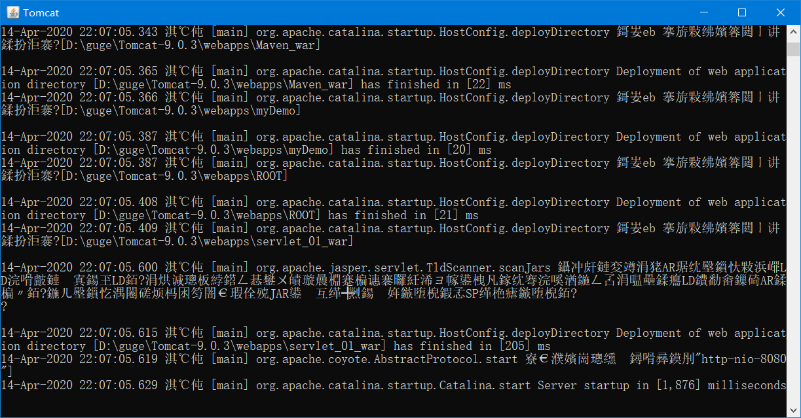

### 模仿某米官网：servlet+jsp 前端jquery

没有使用框架，这个项目的吸收让后面的框架更加容易的上手

运行环境：安装：jdk1.8 mysql+tomcat Maven 

导入Mimall.sql到mysql中

下面是针对没有Maven的环境：

这个mysql一定要设置：

> port:3306   user:root     password:123456

在工具类DBUil数据库驱动连接类中更改你的mysql密码

赋值Mimall.war到tomcat9的webapps下：

或者

然后去tomcat9  bin目录双击：startup.bat

启动成功！

打开浏览器：

前台访问:

>http://127.0.0.1:8080/Mimall/forehome

后台访问：

>http://127.0.0.1:8080/Mimall/admin_category_list

