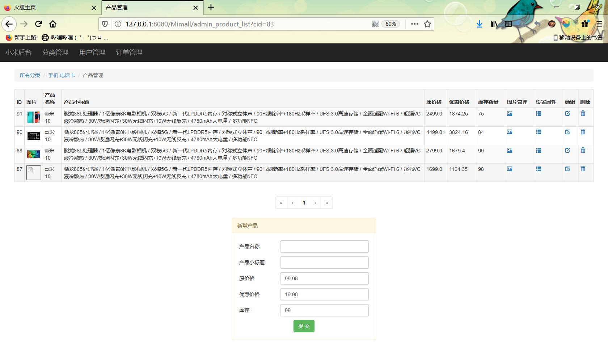

简陋的模仿某米官网（servlet+jsp+jQuery）让后面的框架学起来更加轻松

运行环境：安装：jdk1.8 mysql+tomcat Maven 

导入Mimall.sql到mysql中

在工具类DBUil数据库驱动连接类中更改你的mysql密码

图片非常多所以只留了几张在项目中

打开浏览器：

前台访问:

>http://127.0.0.1:8080/Mimall/forehome

后台访问：

>http://127.0.0.1:8080/Mimall/admin_category_list

效果图：

前台

后台：

